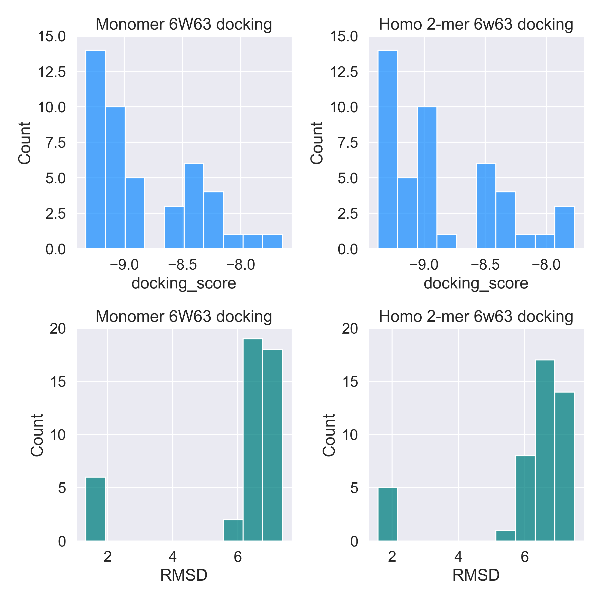

# Docking X77 to 6w63 monomer vs homodimer

PDB 6w63 is a structure of COVID-19 main protease bound to potent broad-spectrum non-covalent inhibitor X77. This docking experiment is repeated five times for better statistics. 

The biological assembly of this structure is homo-2-mer (dimer). 

I found some of the published papers used monomer unit for docking and others dimer unit. 

There are couple of  terminal residues within 5 Å of ligand X77.

Here, the objective is to check if is there any difference if monomer or dimer units are considered. 

__To understand the differences in distribution of "docking_score" and "RMSD" (calculated with obrms) values from five repeats of docking, student's t-test also performed. The p-value is > 0.90 and > 0.64 for docking_score and RMSD respectively.__

**So, statistically these values belong to same distribution.**

For docking, monomer or homo-2-mer won't make any difference. But if docking is furtherevaluated by molecular dynamics simulation, dimer unit should be used as it indicate biological assembly.
The results are shown in figure below:

